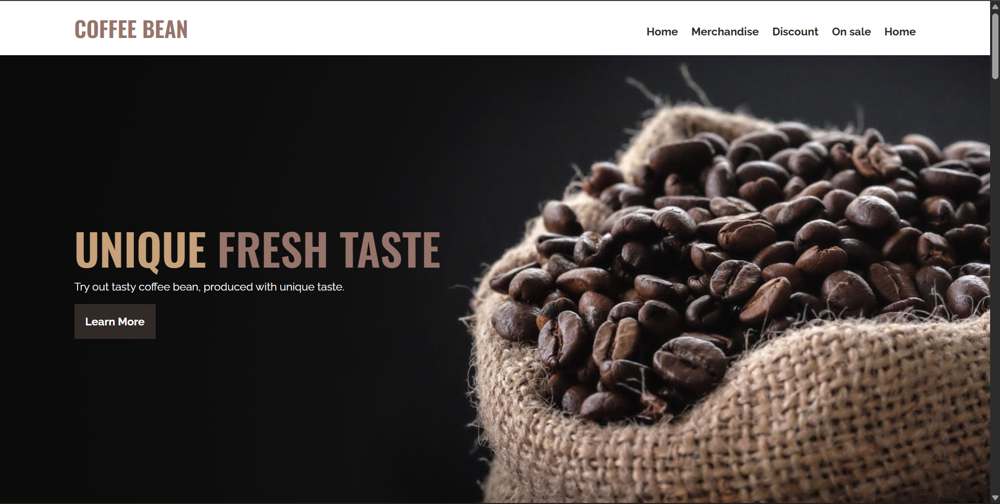
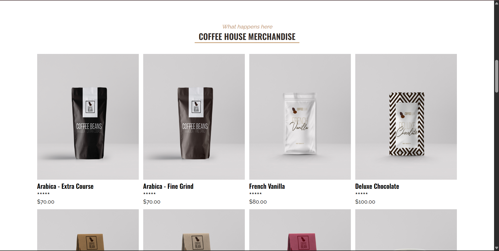
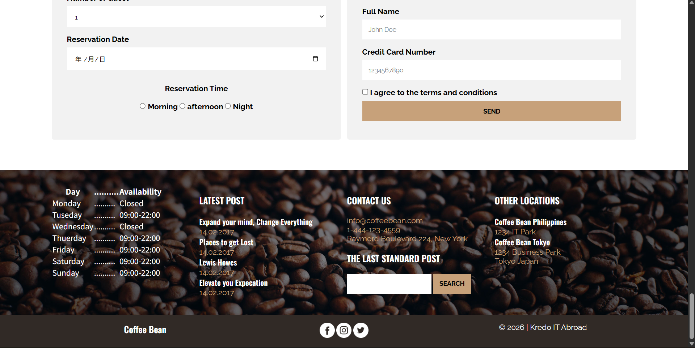

# Coffee Bean Landing Page ☕

A modern coffee shop landing page built using **HTML5** and **CSS3**.

## 📌 Overview

This project is a static landing page for a fictional coffee shop. It focuses on creating a clean, modern, and visually appealing website using semantic HTML and CSS. The page introduces the brand, showcases featured products, highlights promotional offers, and provides contact information.

## 🚀 Live Demo

👉 **Live Site:** https://amy-1-mk.github.io/coffee-bean-january.-github.io/

## 🛠️ Technologies Used

- HTML5
- CSS3

## ✨ Features

- Modern coffee shop landing page design
- Hero section with call-to-action
- Featured products section
- Promotional offer section
- About and contact sections
- Social media icons
- Clean and organized layout

## 📷 Screenshots

### Home

### Featured Products

### Contact

## 📚 Learning Outcomes

Through this project, I improved my skills in:

- Semantic HTML structure
- CSS layout and styling
- Flexbox
- Typography and spacing
- Background images
- Hover effects
- Building a complete landing page from scratch

